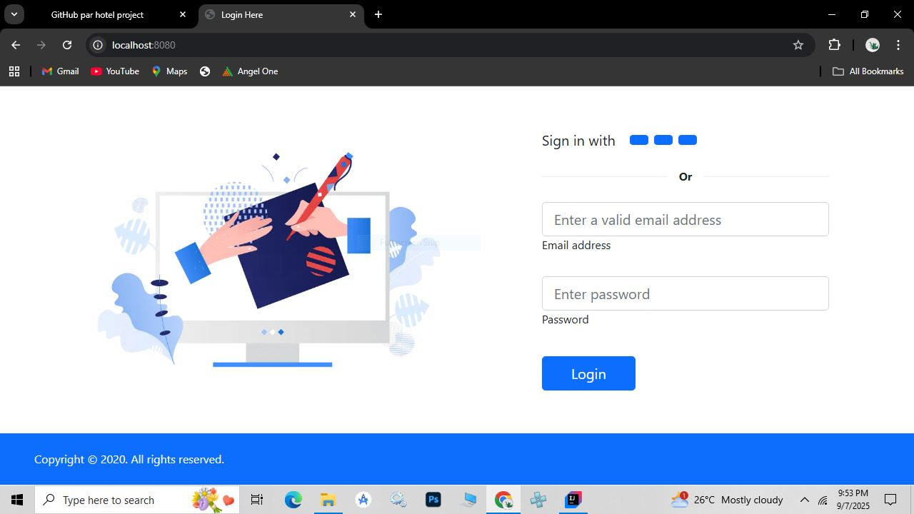
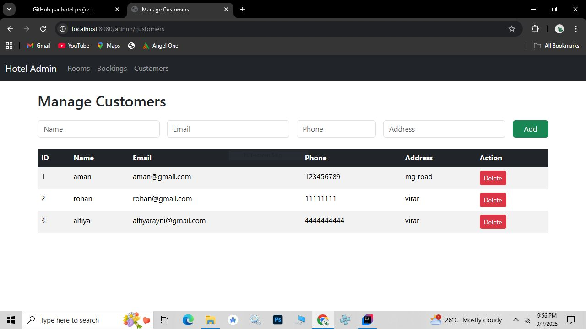
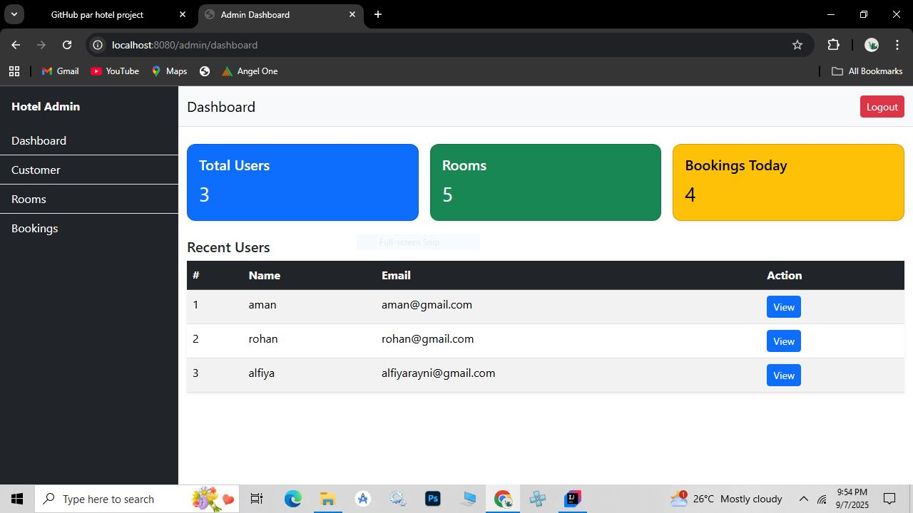

# 🏨 Hotel Management System

A **Spring Boot + Thymeleaf + JPA + Spring Security based Hotel Management System** that helps hotels manage rooms, customers, and bookings efficiently.
This project is beginner-friendly and shows how to build a full-stack web application using Java.

---

## 📖 Introduction

This project is designed to **simplify hotel operations** such as room allocation, booking, and customer management.
It is built using **Spring Boot** for backend, **Thymeleaf** for frontend, **MySQL** for database, and **Spring Security** for authentication.

The goal of this project is to provide:

1. Easy-to-use interface for hotel staff.
2. Centralized system for managing rooms and customers.
3. A dashboard to quickly check hotel status.
4. Secure login/logout for admin access.
5. A foundation for adding advanced features like payments or analytics.

---

## 🚀 Features

1. 🛏️ **Room Management** – Add, update, delete, and view hotel rooms.
2. 👤 **Customer Management** – Register new customers and maintain their details.
3. 📅 **Booking System** – Check-in / Check-out management with status tracking.
4. 📊 **Dashboard** – Overview of total rooms, active bookings, and customers.
5. 🔒 **Authentication** – Admin login and logout using Spring Security with encrypted passwords.
6. 🎨 **User-Friendly UI** – Clean and simple design using Thymeleaf + Bootstrap.

---

## 💻 CRUD Operations

### Rooms

* **Create** – Add new rooms with room type, price, and availability.
* **Read** – View all rooms or a specific room.
* **Update** – Edit room details like availability or price.
* **Delete** – Remove rooms from the system.

### Customers

* **Create** – Add new customers with personal details.
* **Read** – List all customers in the dashboard.
* **Update** – Update customer information.
* **Delete** – Remove customer records.

### Bookings

* **Create** – Make new bookings for available rooms.
* **Read** – Track active and past bookings.
* **Update** – Change booking status (check-in/check-out).
* **Delete** – Cancel bookings if needed.

---

## 📸 Project Screenshots

### Login



### Rooms Page



### Dashboard Page



### Booking Page


### Customer List


---

## ⚙️ How to Run the Project

1. Clone the repository:

   ```bash
   git clone https://github.com/Ubaid200/hotel-management-system.git
   ```

2. Import the **myuser** database in MySQL or create a new one.

3. Open project in your IDE (STS, IntelliJ, or Eclipse).

4. Update `application.properties` with your MySQL DB credentials:

   ```properties
   spring.datasource.url=jdbc:mysql://localhost:3306/myuser
   spring.datasource.username=root
   spring.datasource.password=12345
   spring.jpa.hibernate.ddl-auto=update
   spring.jpa.show-sql=true
   ```

5. Run the project:

   ```bash
   mvn spring-boot:run
   ```

6. Open in browser:

   ```
   http://localhost:8080/login
   ```

---

## 🔑 Default Admin Credentials

* **Email:** `admin@gmail.com`
* **Password:** `admin123` (stored encrypted in DB)

---

## 📝 Notes

* Passwords are encrypted using **BCrypt**.
* Spring Security automatically handles login and logout.
* Ensure **unique emails** in the database to avoid login issues.
* Drop the `user` table if duplicates exist and restart the app to recreate the admin user automatically.
