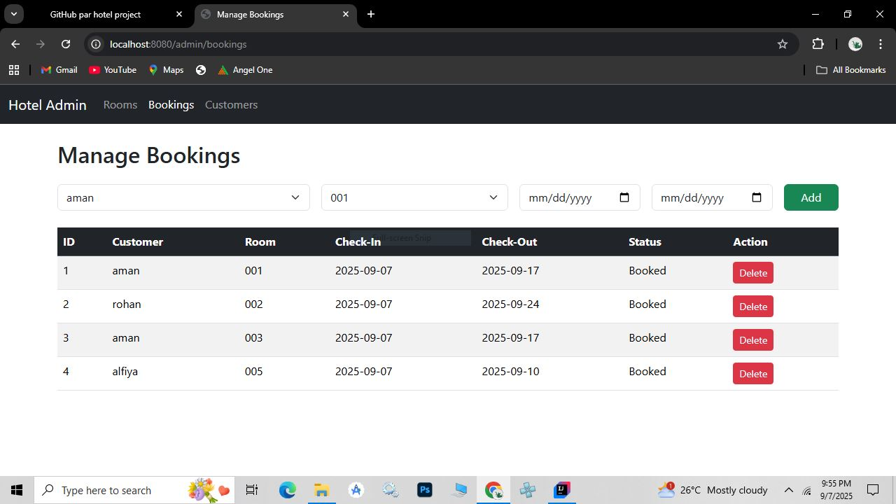

# 🏨 Hotel Management System

A **Spring Boot + Thymeleaf + JPA based Hotel Management System** that helps hotels manage rooms, customers, and bookings efficiently.  
This project is beginner-friendly and shows how to build a full-stack web application using Java.

---

## 📖 Introduction

This project is designed to **simplify hotel operations** such as room allocation, booking, and customer management.  
It is built using **Spring Boot** for backend, **Thymeleaf** for frontend, and **MySQL** for database.  

The goal of this project is to provide:  
1. Easy-to-use interface for hotel staff.  
2. Centralized system for managing rooms and customers.  
3. A dashboard to quickly check hotel status.  
4. A foundation for adding advanced features like authentication and payments.  

---

## 🚀 Features

1. 🛏️ **Room Management** – Add, update, delete, and view hotel rooms.  
2. 👤 **Customer Management** – Register new customers and maintain their details.  
3. 📅 **Booking System** – Check-in / Check-out management with status tracking.  
4. 📊 **Dashboard** – Overview of total rooms, active bookings, and customers.  
5. 🎨 **User-Friendly UI** – Clean and simple design using Thymeleaf + Bootstrap.  

---

## 📸 Project Screenshots

##Login


### Dashboard


### Booking Page


### Customer List


---

## ⚙️ How to Run the Project

1. Clone the repository:  
   ```bash
   git clone https://github.com/Ubaid200/hotel-management-system.git
